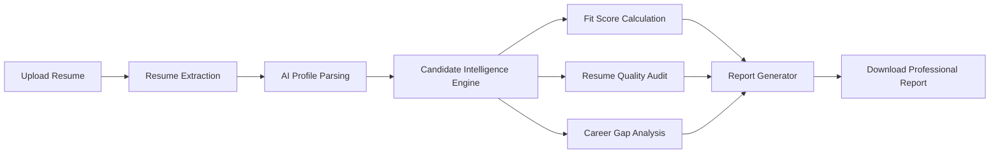
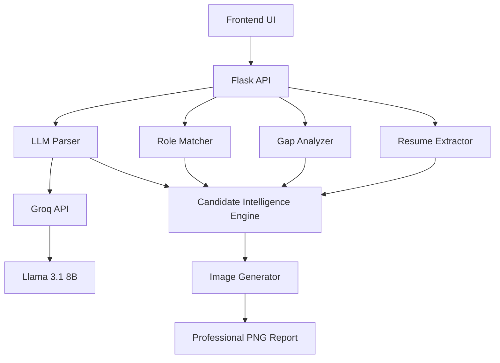

<div align="center"> 

  
# 🚀 TalentLens

<div align="center">


### AI-Powered Resume Intelligence Platform

**Smarter Resume Analysis. Better Hiring Decisions.**

Analyze resumes, evaluate candidate-job fit, detect career gaps, audit resume quality, and generate professional candidate intelligence reports using Generative AI.

<br>


<br>

🎯 Resume Intelligence • 📊 Fit Scoring • 🔍 Career Gap Analysis • 🖼️ AI Report Generation

</div>

---

## ✨ What is TalentLens?

TalentLens transforms traditional resumes into actionable candidate intelligence.

Instead of manually reviewing resumes, recruiters and hiring managers receive a complete AI-generated candidate assessment containing:

✅ Candidate Profile

✅ Technical Skills Analysis

✅ Fit Score Calculation

✅ Resume Quality Audit

✅ Career Gap Detection

✅ Achievement Assessment

✅ Professional Hiring Recommendations

✅ Downloadable Corporate Reports

---

## 🎥 Product Workflow



---

# 🌟 Key Features

<table>
<tr>
<td width="50%">

### 📄 Resume Parsing

* PDF Support
* DOCX Support
* Smart Text Extraction
* Profile Photo Extraction

</td>

<td width="50%">

### 🤖 AI Intelligence

* LLM-Powered Parsing
* Candidate Summarization
* Skill Extraction
* Achievement Detection

</td>
</tr>

<tr>
<td>

### 🎯 Candidate Evaluation

* Job Matching
* Role Alignment
* Experience Analysis
* Certification Assessment

</td>

<td>

### 📊 Analytics

* Fit Score
* Quality Score
* Gap Analysis
* Risk Assessment

</td>
</tr>

</table>

---

# 🏗️ Architecture



---

# ⚙️ Technology Stack

| Layer               | Technologies                   |
| ------------------- | ------------------------------ |
| Frontend            | HTML5, CSS3, JavaScript        |
| Backend             | Python, Flask                  |
| AI Layer            | Groq API, Llama 3.1 8B Instant |
| Document Processing | PyMuPDF, python-docx           |
| Image Generation    | Pillow (PIL)                   |
| Deployment          | Vercel                         |

---

# 🎯 Fit Score Engine

TalentLens evaluates candidates using a weighted scoring system.

| Category            | Weight |
| ------------------- | ------ |
| Technical Skills    | 35%    |
| Experience Duration | 25%    |
| Certifications      | 15%    |
| Role Alignment      | 15%    |
| Achievements        | 10%    |

### Formula

```text
Final Fit Score

=
(Skills × 35%)

+
(Experience × 25%)

+
(Certifications × 15%)

+
(Role Match × 15%)

+
(Achievements × 10%)
```

### Score Interpretation

| Score    | Verdict         |
| -------- | --------------- |
| 90 - 100 | Excellent Match |
| 75 - 89  | Strong Match    |
| 60 - 74  | Moderate Match  |
| Below 60 | Weak Match      |

---

# 📈 Resume Quality Audit

Every resume starts with:

```text
100 Points
```

Points are deducted for:

❌ Missing Contact Information

❌ Weak Experience Descriptions

❌ Missing Education

❌ Unprofessional Keywords

❌ Missing Dates

❌ Poor Formatting

### Quality Verdicts

| Score    | Verdict   |
| -------- | --------- |
| 90 - 100 | Excellent |
| 70 - 89  | Good      |
| 50 - 69  | Average   |
| 30 - 49  | Poor      |
| Below 30 | Worst     |

---

# 🔍 Career Gap Analyzer

TalentLens automatically detects:

### 🎓 Education → Employment Gap

Time between graduation and first job.

### 💼 Employment Gaps

Periods between jobs.

### 🏖 Career Breaks

Long periods without employment.

### 📅 Current Employment Gap

Time since last recorded employment.

---

## Risk Categories

| Gap Duration | Risk      |
| ------------ | --------- |
| 0–3 Months   | 🟢 Low    |
| 3–12 Months  | 🟡 Medium |
| 12+ Months   | 🔴 High   |

---

# 🖼️ AI Report Generation

The platform generates a professional executive-style candidate report.

### Included Sections

* Candidate Profile
* Contact Information
* Technical Skills
* Certifications
* Education
* Career Timeline
* Fit Score
* Resume Quality Score
* Gap Analysis
* Hiring Recommendation

### Output

```text
PNG Report
```

Perfect for:

* Recruiters
* Hiring Managers
* HR Teams
* Staffing Agencies
* Talent Acquisition Teams

---

# 📂 Project Structure

```bash
TalentLens
│
├── api/
│   └── index.py
│
├── backend/
│   ├── extractor.py
│   ├── llm_parser.py
│   ├── gap_analyzer.py
│   ├── role_matcher.py
│   ├── image_generator.py
│
├── frontend/
│   ├── index.html
│   ├── styles.css
│   ├── app.js
│
├── assets/
│
├── requirements.txt
├── vercel.json
└── README.md
```

---

# 🚀 Quick Start

### Clone Repository

```bash
git clone https://github.com/bharat-arv/TalentLens.git

cd TalentLens
```

### Install Dependencies

```bash
pip install -r requirements.txt
```

### Configure Environment Variables

```env
GROQ_API_KEY=your_api_key
```

### Run Application

```bash
python api/index.py
```

---

# 📸 Screenshots

> Add screenshots here for maximum GitHub impact.

### Upload Dashboard

```text
assets/screenshots/upload-dashboard.png
```

### Analysis Dashboard

```text
assets/screenshots/results-dashboard.png
```

### Generated Report

```text
assets/screenshots/final-report.png
```

---

# 🤝 Contributing

Contributions are welcome.

```bash
git checkout -b feature/new-feature

git commit -m "Add amazing feature"

git push origin feature/new-feature
```

Create a Pull Request 🚀

---

<div align="center">

## ⭐ Support the Project

If you like TalentLens, give it a star ⭐

### Built with ❤️ using Python, Flask, Groq & Llama 3.1

**TalentLens**

### Smarter Resume Analysis. Better Hiring Decisions.

</div>

---

### Extra GitHub Enhancement

Add these at the very top:

```markdown
<p align="center">
  
</p>
```

A short GIF showing:
**Upload Resume → Analysis → Generated Report**

This single addition can make the repository look significantly more polished and professional. 🚀
