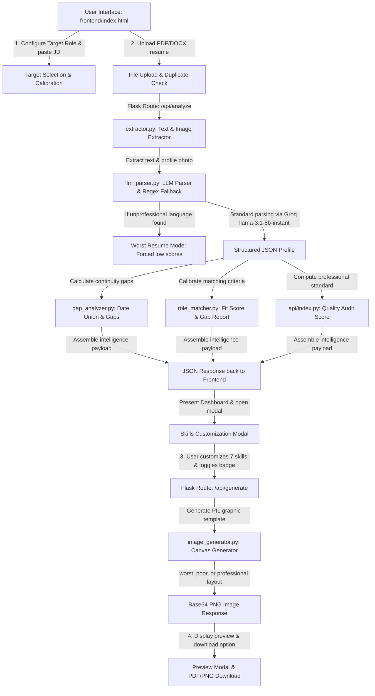

# TalentLens: Architecture, Workflow, and Technical Guide

This guide provides a comprehensive, end-to-end breakdown of **TalentLens**, an Enterprise AI Resume Intelligence platform. It documents how the application parses resumes, extracts attributes, computes scores, performs gap analysis, and generates premium corporate reports.

---

## 1. Flowchart & System Architecture

The following diagram illustrates the lifecycle of a resume in TalentLens, from upload to the final generated corporate report.



---

## 2. Core Workflows

TalentLens operates through a series of synchronized stages:

### A. Role Selection and Job Description (JD) Calibration
1. **Target Selection**: The user selects a target role from the dropdown menu (predefined roles loaded from `backend/job_roles.json` via `/api/job-roles`) or types a custom role.
2. **Fuzzy Expansion**: Users can optionally paste the JD. If pasted, the backend extracts required/preferred skills and certifications using the Groq LLM and merges them with the base role template.

### B. Resume Upload & Content Extraction
1. **Duplicate Prevention**: Files uploaded are MD5-hashed on submission. Uploading the same file within 15 seconds returns a `429 Conflict` to save LLM tokens.
2. **Text Parsing**: `extractor.py` handles:
   - **PDFs**: PyMuPDF (`fitz`) parses page text, strips non-ASCII symbols, and collapses excessive lines.
   - **DOCXs**: `python-docx` extracts paragraphs and table contents.
3. **Avatar/Photo Extraction**:
   - **PDFs**: PyMuPDF looks for raw images. It filters out small icons (less than $60\times60$ pixels) and extracts the largest image as the candidate's portrait.
   - **DOCXs**: Iterates through inline XML image parts, filtering out thumbnail files, and extracts the raw blob.

### C. Analysis and Evaluation
1. **Worst Resume Filter**: Before sending text to Groq, the backend scans for unprofessional keywords (e.g., "bored at home", "pubg", "timepass"). If the cumulative penalty exceeds 50 points, it skips the LLM call and defaults to the **Worst Resume** state.
2. **Structured LLM Parsing**: The system truncates text safely to fit within 12,000 characters and prompts `llama-3.1-8b-instant` to output a JSON object containing education details, experience, certifications, and project summaries.
3. **Score Calibrations**: The server runs backend modules to compute the **Fit Score**, **Quality Score**, and **Career Gaps**.

### D. Customization & PDF Generation
1. **Skills Customization**: The frontend opens a scrollable modal displaying the parsed skills. The user must select exactly 7 skills. They also configure options such as *Include Fit Score* and *Include Best Suited Role*.
2. **Canvas Generation**: The frontend submits the final selected skills and layout choices to `/api/generate`. The backend runs Pillow to render the output image, pasting the profile picture if extracted.
3. **Download**: The user previews the image in a modal and downloads it as a PNG. In **Batch Mode**, processing runs concurrently and returns a compiled `.zip` file using `JSZip`.

---

## 3. Feature Breakdown

### 📊 Fit Score Calculation Formula
The **Fit Score** is a weighted metric (0-100%) indicating how well the candidate matches the target role:

| Component | Weight | Calculation Method |
| :--- | :---: | :--- |
| **Technical Skills** | 35% | Checks if required and preferred skills appear in the structured list or full text. Required matches have full weight; preferred matches have half weight. |
| **Experience Duration** | 25% | Computes the ratio of actual experience to the minimum required experience for the target role, capped at 100%. |
| **Certifications** | 15% | Uses dynamic string alignment. Exact matches score 100%. Shared providers (e.g. AWS) with similar topics score 50%. A shared provider with an unrelated topic scores 25%. |
| **Role Alignment** | 15% | Compares target role vs. current role. Exact match: 100%, Substring match: 90%, Shared seniority/functional keywords: 75%, Both technical roles: 60%, Unrelated: 30%. |
| **Achievements Quality** | 10% | Scans responsibilities for action verbs and numerical indicators (e.g., `%`, `increased`, `million`, `optimized`). Scores 100% if present, else 50%. |

### 🔍 Resume Quality Audit System
The **Quality Score** evaluates layout completeness and tone. Deductions are subtracted from a starting score of 100:

* **Unprofessional Keywords**: -25 (e.g., "urgent", "please hire me")
* **Irrelevant Social Media/Skills**: -20 (e.g., "tiktok", "instagram", "pubg")
* **No Work Experience**: -35
* **Missing Contact Info**: -15 (if email or phone is absent)
* **Missing Date Indicators**: -15 (no year mentioned in history)
* **Vague Descriptions**: -15 (e.g., "worked in many companies")
* **Incomplete Education**: -10 (no degree or school name)
* **Too Short/Bad Formatting**: -10 (less than 100 characters)

#### Quality Verdict Thresholds:
* **$\ge$ 90**: Excellent | **70–89**: Good | **50–69**: Average | **30–49**: Poor | **< 30**: Worst

---

### 📅 Career Gap Analyzer (`gap_analyzer.py`)
This module analyzes the timeline of education and experience. It parses dates using regular expressions (extracting years between 1950 and 2030, and resolving "present"/"current"):

1. **Education-to-Employment Gap**: Measures the duration between graduation and the start of the first job.
2. **Consecutive Employment Gaps**: Measures time spans between consecutive jobs.
3. **Career Breaks**: Identifies breaks by scanning description text for keywords like "sabbatical", "career gap", or "family commitment".
4. **Current Status Gap**: Measures time elapsed between the end date of the last job and the current year.
5. **Non-overlapping Union**: To prevent double counting (e.g., a sabbatical that overlaps with an employment gap), it merges overlapping spans and subtracts explained career breaks from generic gaps:
$$\text{Adjusted Gaps} = \text{Employment Gaps} \setminus \text{Career Breaks}$$
$$\text{Total Gap} = \text{Union}(\text{Education-to-Employment Gap}, \text{Adjusted Gaps}, \text{Career Breaks}, \text{Current Gap})$$

* **Risk Level Indicator**:
  * 0 Years: Green (No Gap)
  * $\le$ 2 Years: Yellow (Minor Gap)
  * 2–3 Years: Orange (Moderate Gap)
  * $>$ 3 Years: Red (Significant Gap)

---

### 🎨 Pillow-Based Image Generator (`image_generator.py`)
Rather than relying on HTML-to-PDF converters, TalentLens uses Pillow to generate resume reports directly on a $1600 \times 1200$ canvas:

* **Worst/Poor Resumes**: Generates high-visibility alert cards displaying critical quality warnings in red and orange.
* **Professional Resumes**: Renders a premium, corporate two-column layout:
  * **Header**: Deep blue banner with teal geometric polygons on the right, initials avatar or circular cropped profile photo, large name, and sub-title.
  * **Left Column**: Displays contact details with vector-like icons, vertical technical skill bars representing skill proficiency, and education blocks.
  * **Right Column**: Displays summary, chronologically ordered work experience with bullet lists, certifications, and achievements.
  * **Optional Overlays**: Dynamically stamps circular color-coded badges for target fit scores.

---

## 4. Technology Stack & Dependencies

```
┌─────────────────────────────────────────────────────────────────────────┐
│                          TALENTLENS WEB APP                             │
├────────────────────────────────────────┬────────────────────────────────┤
│               FRONTEND                 │            BACKEND             │
├────────────────────────────────────────┼────────────────────────────────┤
│ • HTML5 (Semantic Structure)           │ • Python / Flask Web Framework │
│ • Vanilla CSS (Theme variables, HSL)   │ • Groq SDK (AI Parsing Engine) │
│ • Vanilla JavaScript (ES6 Fetch, DOM)  │ • PyMuPDF (fitz) (PDF Parser)  │
│ • JSZip (Batch Compression)            │ • python-docx (Word Parser)    │
│ • FontAwesome 6 (Vector Icons)         │ • Pillow (PIL) (Image Engine)  │
└────────────────────────────────────────┴────────────────────────────────┘
```

---

## 5. API Costing & Token Analysis

The platform is designed to operate cost-effectively using the **Groq Llama 3.1 8B Instant** model.

### Token Usage Estimate (Per Resume)
* **Input Tokens**: ~3,500 tokens (System Instructions + JSON Schema Template + 12,000 character truncated resume text).
* **Output Tokens**: ~1,200 tokens (Structured JSON profile containing extracted details, summaries, and arrays).

### Estimated Costs (Based on Groq Pricing)
* **Llama 3.1 8B Instant Pricing**:
  - Input: **$0.05 / 1,000,000 tokens**
  - Output: **$0.08 / 1,000,000 tokens**

* **Calculation for 1 Resume Analysis**:
$$\text{Input Cost} = 3,500 \times \frac{\$0.05}{1,000,000} = \$0.000175$$
$$\text{Output Cost} = 1,200 \times \frac{\$0.08}{1,000,000} = \$0.000096$$
$$\text{Total Cost Per Resume} \approx \$0.000271$$

> [!NOTE]
> Based on this analysis, you can parse **~3,690 resumes for $1.00 USD** of Groq API credits. This makes it highly scalable for enterprise volume.
